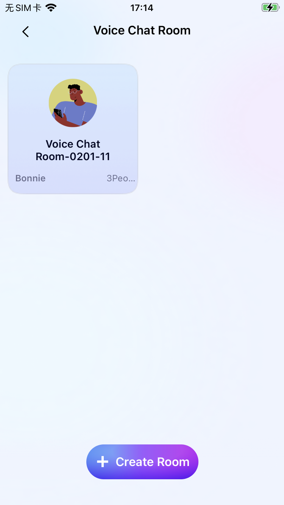
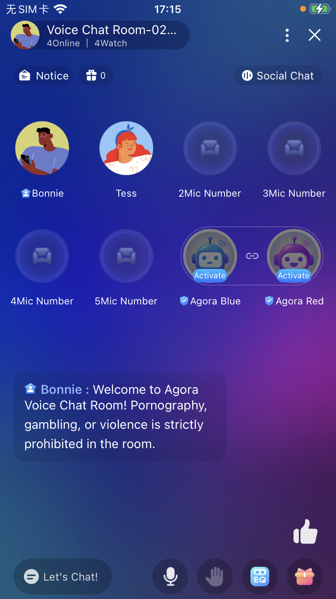

# Voice Chat

> This document mainly introduces how to quickly run through the language chat room example project.
> 
> Demo:
> 
> 

---

## Prerequisites

- Xcode 14 or higher.
- A mobile device that runs iPhone 13.0 or higher.

---

1. Follow [The Account Document](https://docs.agora.io/en/video-calling/reference/manage-agora-account) to get the **App ID**.

2. Follow [The IM Document](https://www.easemob.com/) to get the **IM APP KEY**, **IM Client Id** and **IM Client Secret**.

3. Open the `iOS` project and fill in properties got above to the root [KeyCenter.swift](../../KeyCenter.swift) file. 

	```
	# RTC SDK and IM key Config
	static let AppId: String = <#YOUR AppId#>
	
	static var IMAppKey: String? = <#YOUR IMAppKey#>
	
	static var IMClientId: String? = <#YOUR IMClientId#>
	
	static var IMClientSecret: String? = <#YOUR IMClientSecret#>
	```
4. Now you can run the project with Xcode to experience the application.

---

## Introduction
> 1. **The Voice Chat** project is an open-source code for the Shengwang Language Chat Room scenario. Developers can obtain and add it to your app project. This source code will be updated synchronously with the Voice Chat Demo. In order to obtain more new features and better sound effects, we strongly recommend that you download the latest code integration.
> 
> 2. Scene function code root directory
	**iOS/AgoraEntScenarios/Scenes/VoiceChatRoom**

---

## RestApi network request interaction
> - Room management and interactive requests and responses within the chat room, such as microphone changes, message changes, gift sending and receiving, directed message forwarding, member changes, etc., are handled through[**ChatRoomServiceProtocol**](./Service/ChatRoomServiceProtocol.swift)Define the protocol through[**ChatRoomServiceImp**](./Service/ChatRoomServiceImp.swift)To achieve this, you can replace it with one click through your own ServiceImp implementation without changing the business code

--- 
## The chat room scenario currently covers the following functions, which you can call from the code as needed by referring to the comments:
> 1. Room Management: Room List Management, Creating Rooms

>	- Code path：[RoomService](./Controllers/RoomManager)

> 2. Seat management: Kick, mute microphone, lock microphone
    
>	- he functions related to microphone management mainly rely on the component MicPosView, which can be dragged and dropped into the project for use
>	- [AgoraChatRoomNormalRtcView](./Views/VoiceChat/AgoraChatRoomNormalRtcView.swift)：Basic microphone component, supporting microphone up and down, microphone swapping, mute/unmute, lock/unlock, single microphone refresh, volume update and other microphone functions.
>	- Please refer to the operation logic related to the microphone position[VoiceRoomViewController+Mic.swift](./Controllers/VoiceChat/VoiceRoomViewController%2BMic.swift)

> 3. Interaction, Barrage, Tipping
> 	- IM-related on-screen comment and callback[VoiceRoomViewController+IM.swift](./Controllers/VoiceChat/VoiceRoomViewController%2BIM.swift)
>	- Tipping related to IM [VoiceRoomViewController+ChatBar.swift](./Controllers/VoiceChat/VoiceRoomViewController%2BChatBar.swift)
>	- Huanxin IM is used in the current version, and users can choose the integrated IM.

> 4. Sound effect: the best sound effect in the sound network, AI noise reduction
>	- Reference for sound effect method:[VoiceRoomViewController+ChatBar.swift](./Controllers/VoiceChat/VoiceRoomViewController+ChatBar.swift) func showEQView()
>	- this method supports the unified processing of sound effects.

---

## Usage scenario

> The ultimate goal of the source code for voice and action chat on Shengwang is to facilitate developers to quickly integrate on demand and reduce the workload of building chat rooms. On the basis of existing source code, you can freely customize according to your needs, including UI/UE, front-end logic, permission system, etc


---


### Contact us

> Plan 1: If you are already using Shengwang services or are in the process of docking, you can directly contact the docked sales or service.
>
> Plan 2: Send an email to [support@agora.io](mailto:support@agora.io) for consultation
>
> Plan 3: Scan the QR code to join our WeChat communication group to ask questions
>
> 
---

## License

The sample projects are under the [MIT license](../LICENSE).